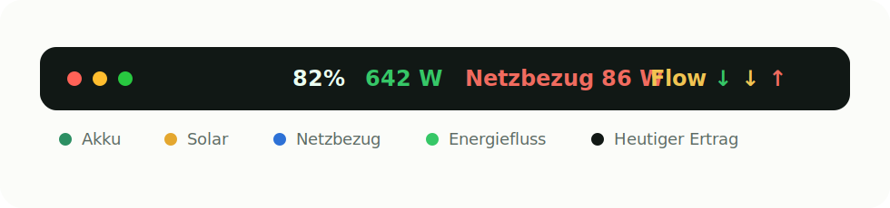
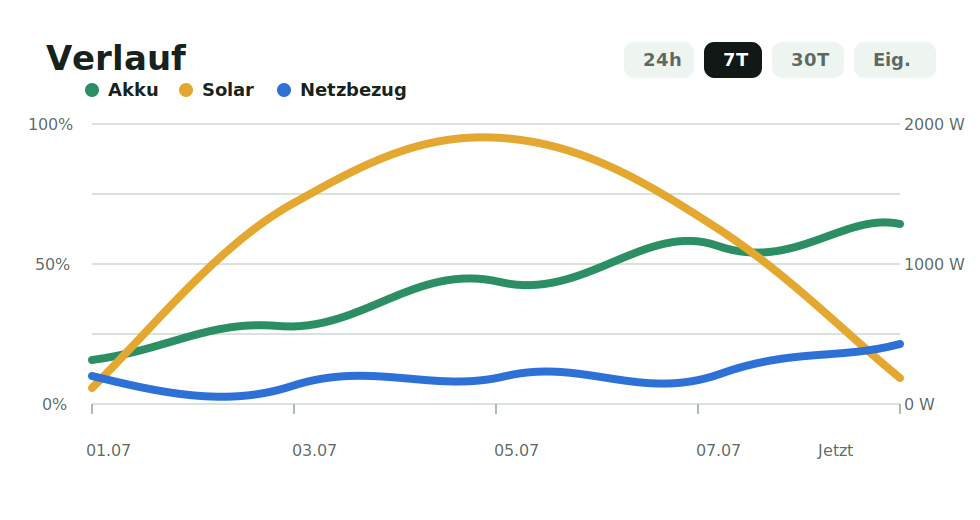

# SolixBar

SolixBar is a native macOS menu bar app for showing Anker SOLIX battery and solar overview data.

It provides a compact menu bar readout, a modern dropdown dashboard, a history graph, and a floating desktop widget window.

Project homepage files are in [`docs/`](docs/) and can be published with GitHub Pages.

## Screenshots





## Features

- Native AppKit menu bar app.
- Demo data mode for testing without credentials.
- Live data via local JSON command or JSON URL.
- Configurable menu bar values, labels, symbols, app icon visibility, and scaling.
- Optional colored energy-flow arrows in the menu bar.
- Login autostart support.
- Dropdown dashboard with battery, solar, home consumption, grid import, battery flow, daily yield, total yield, and status.
- Animated history graph for battery, solar, and grid import.
- Graph ranges: current, 24 hours, 7 days, 30 days, and custom.
- Configurable graph lines for battery, solar, and grid import.
- Enlarged graph view on click with its own graph controls.
- Floating desktop widget window.
- Short tooltips for settings and dashboard fields.

## Version

Current version: `0.1.15`

See [CHANGELOG.md](CHANGELOG.md) for release notes.

## Requirements

- macOS 14 or newer.
- Swift toolchain / Xcode command line tools for building locally.
- Optional: a JSON-producing Anker SOLIX helper command or local JSON endpoint for live data.

## Build and Run

Run directly from SwiftPM:

```bash
swift run SolixBar
```

Create a double-clickable app bundle:

```bash
sh scripts/package_app.sh
open outputs/SolixBar.app
```

## Data Source Modes

SolixBar supports three modes:

- `Demo`: generated sample data, useful for testing the UI.
- `Lokaler JSON-Befehl`: runs a local command and reads JSON from stdout.
- `JSON-URL`: fetches JSON from a local or remote HTTP endpoint.

The JSON should look like this:

```json
{
  "siteName": "Anker SOLIX",
  "batteryPercent": 82,
  "solarWatts": 642,
  "homeWatts": 318,
  "gridWatts": -86,
  "batteryWatts": 238,
  "todayKWh": 3.74,
  "totalKWh": 427.8,
  "status": "Online",
  "updatedAt": "2026-07-06T19:30:00Z"
}
```

## Live SOLIX Data

Anker does not provide a stable public SOLIX API. This project includes a helper script prepared for the unofficial community library `thomluther/anker-solix-api`.

Recommended local command for SolixBar:

```bash
/Users/holger/Documents/Codex/2026-07-06/bi/scripts/run_solix_snapshot.sh
```

The app can create the local ignored credentials file for you. Open
`Einstellungen` -> `Datenquelle`, choose `Lokaler JSON-Befehl`, enter email,
password, and country under `SOLIX Login`, then press `Speichern`.

You can still switch back to `Demo` or `JSON-URL`; SolixBar only shows the
fields needed for the selected mode.

SolixBar writes this local file:

```bash
ANKER_SOLIX_USER='you@example.com'
ANKER_SOLIX_PASSWORD='your-password'
ANKER_SOLIX_COUNTRY='DE'
```

Manual example command after replacing credentials:

```bash
ANKER_SOLIX_USER="you@example.com" \
ANKER_SOLIX_PASSWORD="..." \
ANKER_SOLIX_COUNTRY="DE" \
/path/to/python \
scripts/solix_snapshot.py
```

Put the command into SolixBar settings under `Lokaler JSON-Befehl` only if you do not use the built-in SOLIX login fields.

For security, avoid committing credentials. A future improvement should store credentials in the macOS Keychain.

## Repository Notes

The repository intentionally excludes local build products, packaged apps, Python runtimes, and downloaded API checkouts.
